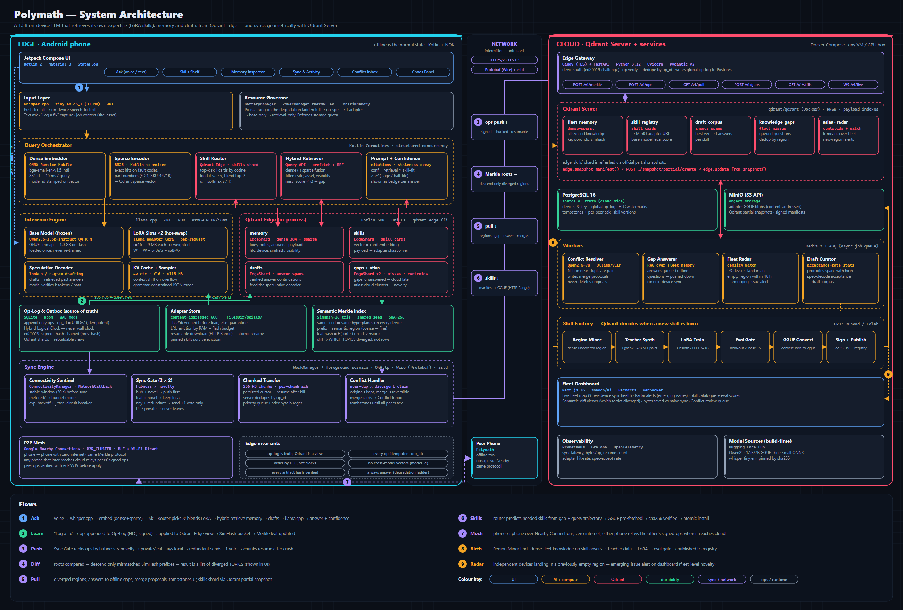
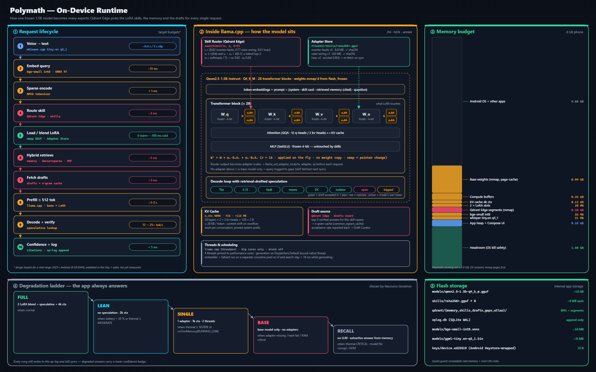
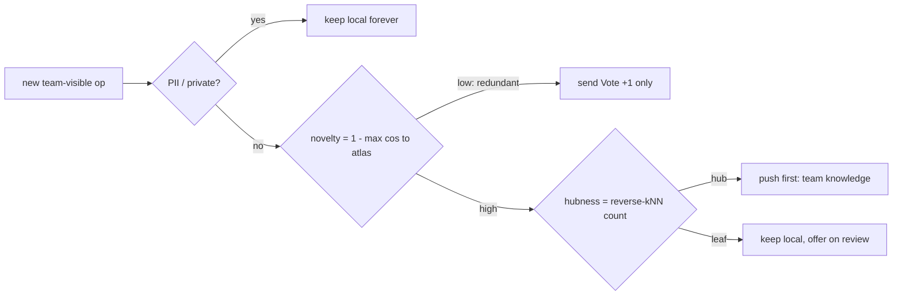
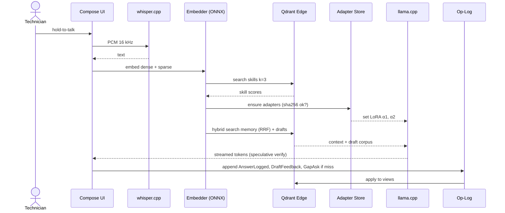
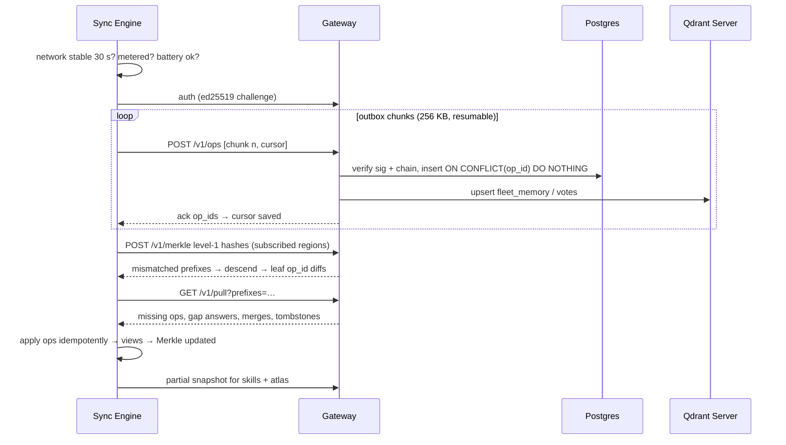
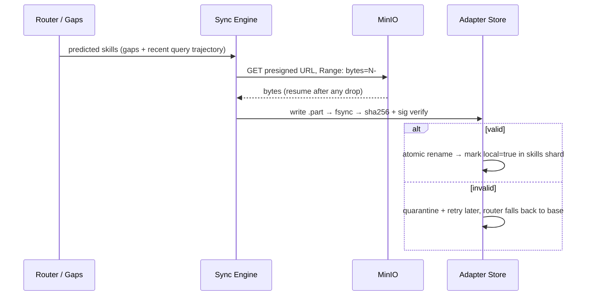
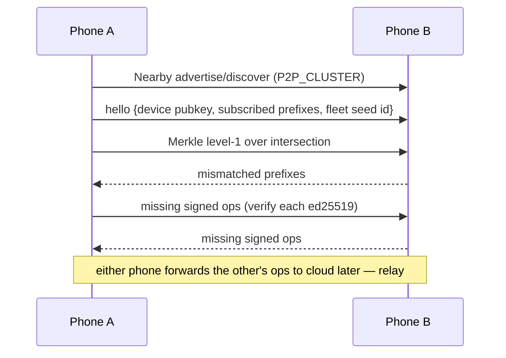
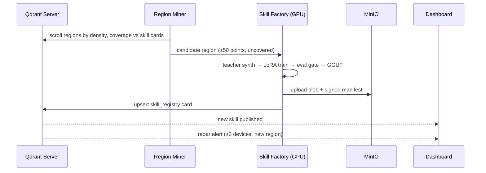

# Polymath — Architecture

> An offline-first Android app where **one frozen 1.5B LLM becomes many experts** because Qdrant Edge retrieves its **skills (LoRA adapters)**, **memory** and **draft tokens** for every request. **Qdrant Server** turns the fleet's knowledge into sync decisions, alerts and new skills.





> Diagram sources: `docs/diagrams/src/*.py` → `docs/diagrams/render.sh` regenerates SVG + PNG.

---

## 1. Design principles

| # | Principle | Consequence |
|---|-----------|-------------|
| P1 | **Offline is the normal state** | Every feature must work with zero network. Sync is opportunistic background work. |
| P2 | **Op-log is the source of truth; Qdrant is a view** | Every mutation is first appended to a signed, append-only op-log (SQLite). Qdrant shards can be deleted and rebuilt from it. |
| P3 | **Everything is idempotent** | Each op has a UUIDv7 `op_id`. Applying it twice is a no-op, on both edge and cloud. |
| P4 | **Never trust wall clocks** | Ordering uses Hybrid Logical Clocks (HLC). Phone clocks are allowed to be wrong. |
| P5 | **Never compare vectors across models** | Every vector carries `model_id`. A mismatch means re-embedding from the stored text. |
| P6 | **Never load an unverified artifact** | Models and adapters are content-addressed (sha256) and signed (ed25519). |
| P7 | **Always answer** | A degradation ladder steps down to retrieval-only if the LLM can't run. |
| P8 | **Geometry makes the decisions** | Routing, sync priority, conflict detection, alerts and skill training are all triggered by vector-space signals. |

---

## 2. Component catalogue

### 2.1 Edge (Android)

| Component | Tech | Responsibility |
|---|---|---|
| UI | Kotlin 2, Jetpack Compose, Material 3, Hilt, StateFlow | Ask, Skills Shelf, Memory Inspector, Sync & Activity, Conflict Inbox, Chaos Panel |
| Speech-to-text | whisper.cpp `tiny.en` q5_1 via JNI | Push-to-talk, fully offline |
| Dense embedder | ONNX Runtime Mobile, `bge-small-en-v1.5` int8 (384-d) | Query + document embeddings, stamped with `model_id` |
| Sparse encoder | BM25 tokenizer (Kotlin) → Qdrant sparse vector | Exact hits on fault codes and part numbers |
| Skill Router | Qdrant Edge `skills` shard | Top-k skill cards → load / blend decision + α weights |
| Hybrid Retriever | Qdrant Edge Query API (prefetch dense + sparse, RRF fusion)¹ | Memory retrieval with payload filters (site, asset, visibility) |
| Inference engine | llama.cpp (NDK/CMake, JNI), arm64 NEON / i8mm | Base model + LoRA hot-swap + lookup speculative decoding |
| Base model | `Qwen2.5-1.5B-Instruct` Q4_K_M GGUF (~1.0 GB, mmap) | Frozen generalist |
| Skills | LoRA r=16 on q/k/v/o, GGUF (~9 MB each) | Domain experts, blended at runtime |
| Vector store | **Qdrant Edge** Kotlin SDK (UniFFI over `qdrant-edge-ffi`) | Shards: `memory`, `skills`, `drafts`, `gaps`, `atlas` |
| Op-log / outbox | SQLite via Room (WAL mode) | Source of truth, HLC, hash chain, sync cursors |
| Crypto | Android Keystore + ed25519 (Tink / lazysodium), SHA-256 | Device identity, op signatures, artifact verification |
| Adapter Store | App-private files, content-addressed | sha256 verify, LRU eviction, resumable download |
| Semantic Merkle Index | Kotlin, SimHash-16 with shared seed | Region hashes for anti-entropy |
| Sync Engine | WorkManager + foreground service, OkHttp, Wire (Protobuf), zstd-jni | Gate, chunked transfer, pull, conflicts |
| P2P Mesh | Google Nearby Connections (`P2P_CLUSTER`, BLE + Wi-Fi Direct) | Phone ↔ phone sync with no internet |
| Resource Governor | BatteryManager, PowerManager thermal status, `onTrimMemory`, StatFs | Chooses the degradation-ladder rung and enforces quotas |

¹ If the Edge SDK lacks `prefetch` + fusion, run dense and sparse searches separately and do RRF in Kotlin (~20 lines).

### 2.2 Cloud (Docker Compose)

| Component | Tech | Responsibility |
|---|---|---|
| Reverse proxy | Caddy 2 (automatic TLS) | TLS termination, rate limits |
| Edge Gateway | FastAPI, Python 3.12, Uvicorn, Pydantic v2, `qdrant-client` | Device auth, op verify/dedupe, Merkle, pull, gaps, skills, WebSocket |
| Vector DB | **Qdrant Server** (`qdrant/qdrant`) | `fleet_memory`, `skill_registry`, `draft_corpus`, `knowledge_gaps`, `radar_regions`, `atlas` |
| Relational DB | PostgreSQL 16 | Devices & keys, global op-log, HLC watermarks, tombstones + acks, skill versions |
| Object storage | MinIO (S3 API) | Adapter GGUF blobs, Qdrant partial snapshots, signed manifests |
| Job queue | Redis 7 + ARQ | Async workers |
| Cloud LLM | Qwen2.5-7B-Instruct via Ollama (dev) / vLLM (GPU) | Conflict adjudication, gap answers, teacher data |
| Skill Factory | Unsloth / HF PEFT, llama.cpp `convert_lora_to_gguf.py` | Mine → synth → train → eval → convert → sign → publish |
| Dashboard | Next.js 15, shadcn/ui, Tailwind, Recharts, WebSocket | Fleet map, radar alerts, skill catalogue, semantic diff, conflicts |
| Observability | Prometheus, Grafana, OpenTelemetry | Sync, inference and skill metrics |
| Fault injection | Toxiproxy | Latency, flapping and cut links for tests and the on-stage chaos demo |

---

## 3. Data model

### 3.1 Qdrant Edge shards (on the phone)

| Shard | Vectors | Key payload fields (indexed ★) | Purpose |
|---|---|---|---|
| `memory` | `dense` 384 cosine + `sparse` BM25 (IDF) | ★`simhash` (u16), ★`visibility` (`private`/`team`), ★`site_id`, ★`asset_type`, `text`, `author`, `hlc`, `model_id`, `knn_radius`, `status` (`active`/`disputed`/`superseded`), `synced_at` | Fixes, notes, answers |
| `skills` | `card` 384 cosine | `skill_id`, `version`, `sha256`, `size`, `base_model`, `eval_score`, `local` (bool), `pinned` | Skill routing |
| `drafts` | `dense` 384 | ★`skill_id`, `text`, `accept_rate` | Speculative decoding source |
| `gaps` | `dense` 384 | `query`, `hlc`, `best_score`, `status` (`open`/`answered`) | Offline misses → cloud |
| `atlas` | `centroid` 384 | `region_id`, `label`, `radius`, `cloud_count` | Local shadow of cloud clusters → novelty score |

`skills` and `atlas` are **cloud-owned**. They are refreshed with Qdrant Edge's official **partial snapshot** flow: `snapshot_manifest()` → `POST /collections/{c}/shards/0/snapshot/partial/create` → `update_from_snapshot()`.
`memory`, `drafts` and `gaps` are **device-owned** and synced through the op-log.

### 3.2 Qdrant Server collections (cloud)

| Collection | Content |
|---|---|
| `fleet_memory` | All team-visible memory from every device (same schema as edge `memory` + `device_id`, `votes`) |
| `skill_registry` | Skill cards + MinIO URI + eval metrics (source of edge `skills`) |
| `draft_corpus` | Curated high-acceptance answer spans per skill |
| `knowledge_gaps` | Fleet-wide unanswered questions, deduped by region |
| `atlas` | k-means centroids over `fleet_memory` (source of edge `atlas`) |
| `radar_regions` | Watch-list of newly dense regions (devices × time window) |

### 3.3 Operation (Protobuf, `proto/sync.proto`)

```proto
message Hlc { uint64 wall_ms = 1; uint32 logical = 2; string node = 3; }

message Op {
  bytes  op_id     = 1;   // UUIDv7, idempotency key
  string device_id = 2;
  Hlc    hlc       = 3;
  oneof body {
    Upsert upsert = 10;  Delete delete = 11;  Merge merge = 12;
    Vote   vote   = 13;  GapAsk gap    = 14;  DraftFeedback fb = 15;
  }
  bytes prev_hash = 20;   // per-device hash chain
  bytes sig       = 21;   // ed25519 over canonical bytes of 1..20
}
message Upsert {
  string point_id = 1;  string shard = 2;  string text = 3;
  bytes dense_f16 = 4;  SparseVec sparse = 5;  string model_id = 6;
  uint32 simhash = 7;   Visibility vis = 8;  map<string,string> payload = 9;
}
message Merge  { repeated string supersedes = 1; Upsert result = 2; string rationale = 3; }
message Vote   { string cloud_point_id = 1; }            // "+1, I saw this too" (a few bytes, no vector)
message Delete { string point_id = 1; }                  // becomes a tombstone
```

### 3.4 Op-log tables (SQLite / Room)

| Table | Columns |
|---|---|
| `ops` | `op_id` PK, `hlc`, `kind`, `bytes`, `prev_hash`, `sig`, `applied` |
| `outbox` | `op_id`, `priority`, `state` (`queued`/`sent`/`acked`), `attempts`, `next_try_at` |
| `sync_cursor` | `peer` (`cloud`/device id), `last_acked_hlc`, `in_flight_batch`, `chunk_idx` |
| `tombstones` | `point_id`, `hlc`, `acked_by` (set) |
| `conflicts` | `id`, `a`, `b`, `kind`, `proposal`, `state` |
| `adapters` | `sha256`, `skill_id`, `version`, `bytes`, `last_used`, `pinned`, `state` |

---

## 4. Core algorithms

### 4.1 Skill routing and blending
```
s  = search(skills, q, k=3)                     # cosine on skill cards
if s1 < τ (0.60):   base model only, log gap(q) # skill may be fetched next sync
elif s1 - s2 < δ (0.10):  blend top-2, α = softmax([s1, s2] / T=0.05)
else:               single adapter, α1 = 1.0
llama_set_adapter_lora(ctx, A_i, α_i)            # per request, no weight copy
```
A skill card vector is the mean of *(the card description embedding, the centroid of its training questions)*. This keeps routing robust to how technicians actually phrase questions.

### 4.2 Hybrid retrieval and confidence
- `prefetch(dense, k=20) + prefetch(sparse, k=20) → RRF → top-5`, filtered by `visibility ∈ {team, private-mine}` and `status ≠ superseded`.
- `confidence = retrieval_score × skill_fit × exp(-age_since_reconciled / half_life)` → High / Medium / Low badge.
- `disputed` points are shown side by side with a warning and are never silently merged.

### 4.3 Speculative decoding from memory
Top-3 `drafts` for (skill, query) plus top retrieved memory text → llama.cpp n-gram lookup cache → the model verifies up to *k* = 5 draft tokens per forward pass. Per-span acceptance rates are logged as `DraftFeedback` ops. The cloud Draft Curator promotes the best spans.

### 4.4 Semantic Merkle anti-entropy
- **Shared seed → same hyperplanes.** Every node derives 16 Gaussian hyperplanes from a fleet seed (PCG64). `simhash(v)` = 16 sign bits. Nearby vectors share prefixes, so each prefix is a semantic region.
- **Tree.** 16-ary, 4 levels (4 bits per level). Leaf hash = `SHA-256(sorted(op_id ‖ hlc))` for the points in that bucket. Inner hash = hash of child hashes. Empty subtrees get a constant hash.
- **Scope.** Compared over *team-visible* points in the regions the device **subscribes to** (regions it has used or cached). A phone holds a subset of the cloud, so it is never compared against the whole fleet.
- **Diff.** Exchange level-1 hashes (16 values), then descend only into mismatches. At the leaves, exchange `op_id` lists and pull or push the missing ops.
- **UI.** Each mismatched prefix is labelled with its nearest `atlas` centroid, e.g. *"diverged: inverter faults, warranty policy"*.
- The **outbox is the fast path** (push what I know is new). **Merkle is the repair path** (catch anything missed, plus other devices' updates in my regions). P2P uses the same protocol over the intersection of both phones' subscriptions.

### 4.5 Sync Gate (what leaves the phone)

- **Hubness without HNSW internals.** Qdrant doesn't expose graph degree. Each point stores `knn_radius` (similarity to its k-th neighbour). For a new point *p*: `rknn(p) = |{n ∈ kNN(p) : cos(p,n) ≥ n.knn_radius}|`, meaning how many neighbours would adopt *p* as a neighbour. This costs one search.
- Outbox priority = `novelty × (1 + rknn)`, under a byte budget when the network is metered.

### 4.6 Conflict detection and merge
1. On apply (edge or cloud), search the new point's neighbours with `cos ≥ 0.90`, a different author lineage, and a different content hash → candidate pair.
2. Cloud: NLI check with Qwen2.5-7B (JSON output: `entails | contradicts | neutral`). Edge: same prompt with the base model in grammar-constrained JSON mode, or defer to the cloud.
3. `contradicts` → both marked `disputed` + a conflict record. The cloud proposes a `Merge` with a rationale.
4. A person accepts it in the Conflict Inbox → a `Merge` op supersedes both. Originals are kept, so **undo = supersede the merge**.

### 4.7 Fleet Radar
Every 5 minutes: for points added in the last 48 h that have low `atlas` similarity, cluster them (HDBSCAN on the small candidate set). A cluster containing **≥ 3 distinct devices** and **≥ 2 sites** raises an alert with a label from the 7B model, shown live on the dashboard.

### 4.8 Skill Factory trigger
A region becomes a skill candidate when `count(fleet_memory in region) ≥ 50`, `max cos(region centroid, any skill card) < 0.55`, and `votes ≥ 10`. Pipeline: teacher Q/A synthesis (7B) → Unsloth LoRA r=16 on Qwen2.5-1.5B → **eval gate**: held-out answer score must beat base + Δ → `convert_lora_to_gguf.py` → sha256 + ed25519 sign → MinIO + `skill_registry` → phones get it through the `skills` partial snapshot.

---

## 5. Flows

### 5.1 Ask (flow ①)


### 5.2 Sync session with cloud (flows ③ ④ ⑤)


### 5.3 Skill delivery (flow ⑥)


### 5.4 Phone ↔ phone mesh (flow ⑦)


### 5.5 Skill birth and radar (flows ⑧ ⑨)


---

## 6. Resilience: failure matrix

| # | Failure | Detection | Handling |
|---|---|---|---|
| 1 | App killed during a write | Room transaction | Op append is atomic. View application replays unapplied ops on start. |
| 2 | App killed mid-sync | `sync_cursor.in_flight_batch` | Resume from the last acked chunk. The server dedupes by `op_id`. |
| 3 | Network flaps | NetworkCallback | 30 s stable window, exponential backoff with jitter, circuit breaker after 5 failures |
| 4 | Metered / expensive link | `isActiveNetworkMetered` | Budget mode: only hub+novel ops and gap asks, votes batched, no adapters |
| 5 | Phone clock wrong | HLC skew check vs server | HLC ordering. Skew > 5 min gets a UI warning. Ordering is unaffected. |
| 6 | Duplicate / replayed ops | `op_id` PK | `ON CONFLICT DO NOTHING` (Postgres) and an existence check (edge) |
| 7 | Tampered / forged op (bad peer) | ed25519 + `prev_hash` chain | Reject, quarantine the peer, show in Activity |
| 8 | Deleted item resurrects | tombstone vs upsert HLC | Tombstone wins if its HLC is newer. Tombstones are GC'd only after all peers ack. |
| 9 | Concurrent edits of the same fact | near-dup + NLI | `disputed` + merge proposal. Nothing is silently overwritten. |
| 10 | LLM makes a bad merge | human review | Originals kept. Undo = new op superseding the merge. |
| 11 | Embedding model upgraded on some devices | `model_id` mismatch | Separate named vector per model. Re-embed from `text` in the background. Never compared across models. |
| 12 | Qdrant Edge shard corrupted | open error / checksum | Delete the shard and rebuild it from the op-log (P2) |
| 13 | Op-log DB corrupted | SQLite `integrity_check` on boot | Restore from cloud (its own ops) + local views. The hash chain reveals gaps. |
| 14 | Adapter download interrupted | `.part` file | HTTP Range resume, atomic rename after verification |
| 15 | Adapter corrupt / wrong hash | sha256 | Quarantine, fall back to base model, re-fetch |
| 16 | Base model file missing / corrupt | sha256 on boot | RECALL rung (extractive answers), re-download on Wi-Fi |
| 17 | RAM pressure | `onTrimMemory` | Unload the 2nd adapter, shrink ctx, then drop to BASE. Weights are mmap'd, so the OS reclaims pages. |
| 18 | Thermal throttling | thermal status listener | LEAN → SINGLE → RECALL rungs, fewer threads |
| 19 | Low battery | BatteryManager | Pause background sync and consolidation. Foreground ask still works. |
| 20 | Storage full | StatFs quota | Consolidate cold memory into gist points, evict LRU unpinned skills, block large downloads |
| 21 | OS kills background work | WorkManager constraints | All jobs are restart-safe and idempotent. Long downloads use a foreground service. |
| 22 | Cloud down | health check | Nothing changes for the user (P1). Outbox grows within quota and is compacted (latest op per point). |
| 23 | Offline for weeks | outbox size | Compaction, priority ordering, gaps capped with dedup by region |
| 24 | Gateway overloaded | 429 / latency | Server-driven `Retry-After`. Clients jitter. Chunk size adapts. |
| 25 | Partial snapshot fails mid-apply | SDK error | The shard is cloud-owned: retry, or full restore from `unpack_snapshot()` |
| 26 | Unknown / revoked device | device registry | 401, then re-registration flow. Its ops are not accepted. |
| 27 | Hallucinated answer with no support | retrieval score < τ | Answer marked **Low confidence, no source**. The question is logged as a gap. |
| 28 | Poisoned knowledge from one device | votes + author diversity | Skill Factory requires support from multiple devices. Radar requires ≥3 devices. |

The **Chaos Panel** (debug build) triggers #2, #3, #5, #15, #17 and #18 live. Toxiproxy injects #3, #22 and #24 on the cloud side.

---

## 7. Security and privacy

- A device key pair is generated in the Android Keystore. The public key is registered with the gateway, and auth is a signed nonce challenge.
- Every op is signed and hash-chained per device, which makes the history tamper-evident and auditable.
- `private` visibility is enforced at the Sync Gate **and** filtered in gateway queries. PII detection (regex + keyword lists for phone numbers, emails, names in customer fields) forces `private`.
- Adapters, models and snapshots are verified by sha256 + a fleet signing key before use.
- TLS 1.3 everywhere. MinIO uses short-lived presigned URLs.

---

## 8. Performance budgets (targets, to be measured)

| Stage | Target |
|---|---|
| Qdrant Edge search (≤ 50k points) | < 10 ms p95 |
| Embedding (query) | < 25 ms p95 |
| Adapter switch (warm / cold) | < 5 ms / < 150 ms |
| Time to first token (512-token prompt) | < 2.5 s |
| Decode (no spec / with spec) | ≥ 10 / ≥ 18 tok/s |
| Sync: 1,000 ops | < 5 s on 4G, resumable |
| Peak app RAM | < 2.2 GB |

---

## 9. Tech stack (complete)

**Android:** Kotlin 2 · Jetpack Compose · Material 3 · Hilt · Coroutines/Flow · Room (SQLite WAL) · WorkManager · OkHttp · Wire (Protobuf) · zstd-jni · Google Nearby Connections · Android Keystore · Tink/lazysodium (ed25519) · NDK + CMake · **llama.cpp** · **whisper.cpp** · **ONNX Runtime Mobile** · **Qdrant Edge Kotlin SDK (UniFFI)** · JUnit5 · Turbine · Robolectric

**Models:** Qwen2.5-1.5B-Instruct (Q4_K_M GGUF, on-device) · LoRA r=16 skills (GGUF) · bge-small-en-v1.5 (int8 ONNX) · whisper tiny.en (q5_1) · Qwen2.5-7B-Instruct (cloud only)

**Cloud:** Docker Compose · Caddy · FastAPI / Uvicorn / Pydantic v2 · **Qdrant Server** · qdrant-client · PostgreSQL 16 (asyncpg, Alembic) · MinIO · Redis 7 + ARQ · Ollama / vLLM · Unsloth / PEFT / Transformers · llama.cpp conversion tools · scikit-learn / HDBSCAN · Next.js 15 · shadcn/ui · Tailwind · Recharts · Prometheus · Grafana · OpenTelemetry · Toxiproxy · pytest · Testcontainers

---

## 10. Repository layout (planned)

```
polymath/
├── android/
│   ├── app/              Compose UI, navigation, Hilt wiring, Chaos Panel
│   ├── core-llm/         llama.cpp + whisper.cpp JNI (CMake), LoRA + speculative APIs
│   ├── core-embed/       ONNX Runtime embedder, BM25 sparse encoder
│   ├── core-memory/      Qdrant Edge wrapper: shards, router, retriever, confidence
│   ├── core-oplog/       Room DB, HLC, signing, outbox, view rebuild
│   ├── core-sync/        Merkle index, Sync Gate, transfer, pull, Nearby mesh
│   └── core-governor/    battery/thermal/memory → degradation ladder
├── cloud/
│   ├── gateway/          FastAPI app (auth, ops, merkle, pull, gaps, skills, ws)
│   ├── workers/          conflicts, gap answers, radar, drafts, atlas (ARQ)
│   ├── skill-factory/    region mining, teacher synth, Unsloth training, GGUF export
│   ├── dashboard/        Next.js fleet dashboard
│   └── docker-compose.yml
├── proto/sync.proto      single source of truth for the wire format
├── tools/                seed data, chaos scripts, benchmark harness
└── docs/diagrams/        diagram generators + rendered PNG/SVG
```

---

## 11. Open risks and Day-1 checks

| Risk | Check | Fallback |
|---|---|---|
| Qdrant Edge Kotlin SDK availability or maturity on Android | Build a hello-world EdgeShard (upsert + search) on a real phone | Build `qdrant-edge` with `cargo-ndk` + our own UniFFI bindings. The community Flutter package `qdrant_edge` uses the same FFI crate. |
| Query API `prefetch` / RRF on Edge | Test a hybrid query | RRF in Kotlin |
| llama.cpp LoRA hot-swap on Android | Load base + 2 GGUF adapters and switch scales per request | Single-adapter mode, or merged per-skill models (larger download) |
| Speculative lookup speed-up on phone CPU | Benchmark on repetitive procedural answers | Keep it as an optional toggle and report honest numbers |
| Skill training time | 1 LoRA on Colab T4 with ~2k examples | Pre-train 6 skills before the event. Factory demo uses a small run. |
| Nearby Connections reliability | 2-phone transfer of 1 MB | Wi-Fi hotspot + local HTTP between phones |
