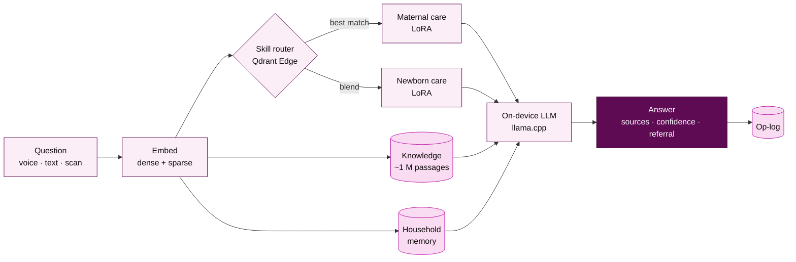
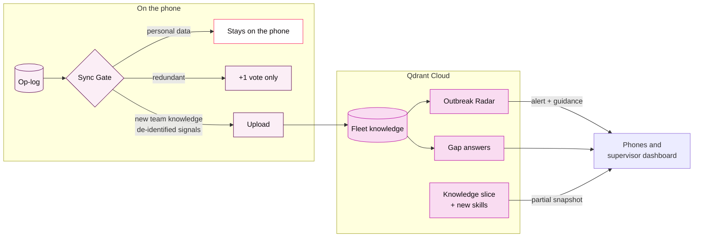

<p align="center">
  
</p>

<h3 align="center">A health expert in every ASHA worker's pocket. No signal required.</h3>

<p align="center">
  Offline-first AI copilot for India's community health workers, built on <b>Qdrant Edge</b> and <b>Qdrant Cloud</b>.
</p>

<p align="center">
  
  
  
  
  
  
</p>

<p align="center">
  <a href="#why-polycare">Why</a> ·
  <a href="#features">Features</a> ·
  <a href="#how-it-works">How it works</a> ·
  <a href="#tech-stack">Tech stack</a> ·
  <a href="#getting-started">Getting started</a> ·
  <a href="#roadmap">Roadmap</a> ·
  <a href="#documentation">Docs</a>
</p>

---

## Why PolyCare

India's **~1 million ASHA workers** each look after about 1,000 people. They track every pregnancy, newborn and child, give first-line advice and decide who must go to a health centre *today*. They do it from memory and paper registers, often where the phone shows no signal.

| The problem | What PolyCare does |
|---|---|
| No connectivity at the doorstep | Everything runs **on the phone**: the LLM, speech, OCR and vector search |
| Hundreds of protocols to remember | A small LLM becomes a specialist per question through **LoRA skills** routed by Qdrant Edge |
| Missed danger signs cost lives | **Danger-sign triage** with a rule table and cited protocol sources |
| Paperwork eats the day | **On-device OCR** fills records from MCP cards, lab reports and prescriptions |
| Outbreaks are noticed weeks late | **Outbreak Radar** in Qdrant Cloud spots symptom clusters across villages |
| Health data is sensitive | Personal records **never leave the phone**; only de-identified signals sync |

> Built for the Geek Room × Qdrant Hackathon, Problem Statement 03: *AI-Powered Edge Memory & Intelligence Platform*.

## Features

**At the doorstep**
- **Ask** by voice or text in Hindi or English, fully offline, with sources and a confidence badge
- **Danger-sign triage**: refer now, refer within 24 h, or care at home
- **Medicine helper** and **counselling cards** for families

**Less paperwork**
- **Scan** MCP cards, lab reports, prescriptions and medicine strips with on-device OCR
- **Household memory** searchable by meaning, plus a **due list** and **visit planner**
- **Monthly report** and incentive tracker filled from recorded visits

**Team and district intelligence**
- **Sync with Qdrant Cloud** whenever a connection appears, resumable and conflict-aware
- **Gap answering**: questions asked offline are answered by the cloud on the next sync
- **Outbreak Radar** and a **supervisor dashboard**
- **Conflict Inbox** when two workers record different details

**Built to be trusted**
- Always answers: steps down gracefully on low battery, heat or low memory
- Up to **~1 million knowledge passages** searchable on the phone
- Memory Inspector and Activity log show what the phone knows and what synced

## How it works

### Asking a question, fully offline



### Syncing when a connection appears



## Tech stack

| Layer | Technologies |
|---|---|
| **App** | Kotlin 2, Jetpack Compose, Material 3, Hilt, Coroutines/Flow, Room, WorkManager |
| **On-device AI** | llama.cpp (Qwen2.5-1.5B + LoRA skills), whisper.cpp, ONNX Runtime (multilingual-e5-small), Google ML Kit OCR |
| **Vector search** | Qdrant Edge (on the phone), Qdrant Cloud (sync, radar, knowledge slices) |
| **Sync & security** | Protobuf, OkHttp, hybrid logical clocks, Android Keystore, Tink (ed25519), SQLCipher |
| **Cloud** | FastAPI, PostgreSQL, S3/MinIO, Redis + ARQ, Qwen2.5-7B, Next.js dashboard |

## Getting started

**Requirements:** JDK 17 · Android SDK (platform 35) · an arm64 Android phone (Android 10+, 4 GB+ RAM recommended) with USB debugging enabled.

```bash
git clone <repo-url> polycare
cd polycare/android

bash ../native/build-qdrant-edge.sh   # first time: builds Qdrant Edge for Android (~15 min)
./gradlew test                        # unit tests
./gradlew :app:installDebug           # build and install on the connected phone
```

Building Qdrant Edge needs Rust (stable ≥ 1.98, target `aarch64-linux-android`), `cargo-ndk` and the Android NDK. On Windows also install MinGW-w64: `winget install BrechtSanders.WinLibs.POSIX.UCRT`.

On Windows use `gradlew.bat`. Model files are downloaded on first run and verified by sha256 before loading.

## Project structure

```
android/        Kotlin app and core modules
  app/            Compose UI, navigation, brand theme
  core-common/    hybrid logical clock, UUIDv7, config
  core-vector/    vector store interface, hybrid search fusion
  core-governor/  battery, heat and memory → operating mode
  qdrant-edge/    Qdrant Edge bindings (UniFFI) + VectorStore adapter
native/         build-qdrant-edge.sh: Qdrant Edge for Android arm64
cloud/          gateway · workers · skill factory · dashboard      (planned)
proto/          sync.proto wire format                             (planned)
assets/         banner, logo, Tenor Sans
```

## Roadmap

| Milestone | Scope | Status |
|---|---|---|
| **M0** | Foundations and feasibility checks | 🟣 In progress (5/10) |
| **M1** | On-device knowledge and hybrid search | 🟣 In progress (4/5) |
| **M2** | Offline health assistant and triage | 🟣 In progress (2/8, +3 partial) |
| **M3** | Households, OCR and daily work | ⚪ Planned |
| **M4–M5** | Evolving memory and conflicts | ⚪ Planned |
| **M6** | Sync with Qdrant Cloud | ⚪ Planned |
| **M7** | Outbreak Radar, gap answering, knowledge slicing | ⚪ Planned |
| **M8–M10** | A million points on the phone, reliability, complete product | ⚪ Planned |

Full checklist in [MILESTONES.md](MILESTONES.md).

## Documentation

| Document | Contents |
|---|---|
| [PROJECT_DESCRIPTION.md](PROJECT_DESCRIPTION.md) | Users, problem, features, business model, demo script |
| [ARCHITECTURE.md](ARCHITECTURE.md) | Components, data model, algorithms, flows, failure handling |
| [MILESTONES.md](MILESTONES.md) | What we build, in order, and the problem-statement checklist |
| [CLAUDE.md](CLAUDE.md) | Engineering invariants and conventions |

## Responsible use

PolyCare is **decision support, not a diagnosis tool**. Referral decisions come from official protocol rules; the AI explains them and always cites its source. Personal health records stay on the worker's phone.

---

<p align="center">
  <br/>
  <sub>PolyCare · Geek Room × Qdrant Hackathon 2026</sub>
</p>
